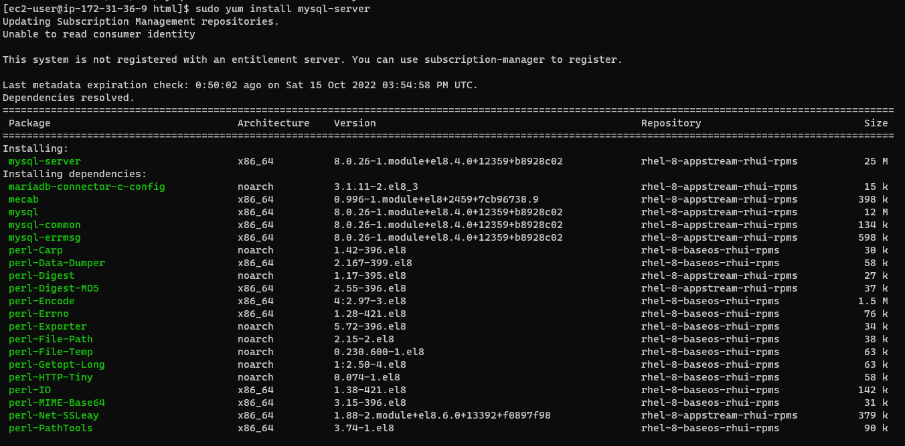
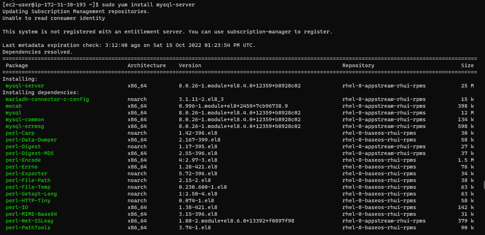
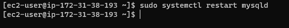
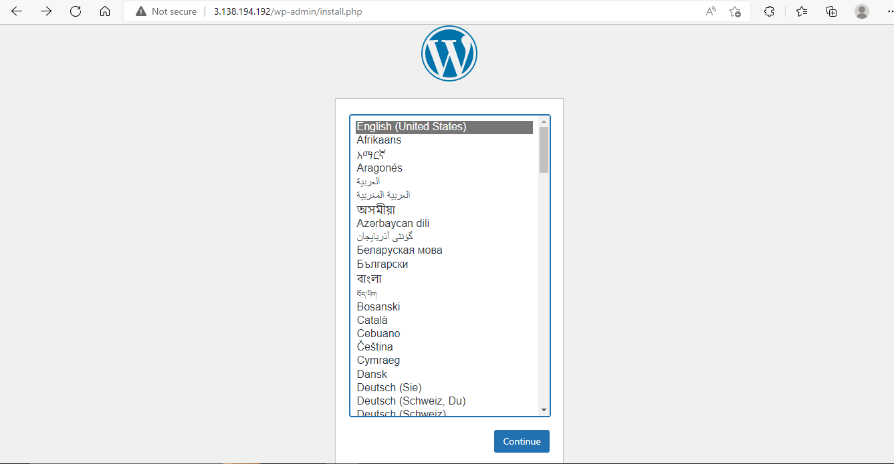

# Project 6: WEB SOLUTION WITH WORDPRESS

Step 0:  Preparing prerequisites

- Sign in to AWS free tier account and create two new EC2 Instances of t2.nano family with RedHat OS
- Name the new instances
- Server A name - "web-server"
- Server B name - "database-server"
  
Step 1:  Creating and adding EBS Volume to EC2 instances

- Create 3 volumes , each of 10 GiB (web1, web2 and web3) and (db1, db2 and db3) and attach them to the EC2 instances, "web-server" and "database-server" respectively.
- Connect to these instances via SSH on two different windows terminals renamed as;
- Server A name - "web-server"
- Server B name - "database-server"

Tasks:

1. Configure storage subsystem for Web and Database servers based on Linux OS. The focus of this part is to give you practical experience of working with disks, partitions and volumes in Linux.
2. Install WordPress and connect it to a remote MySQL database server. This part of the project will solidify your skills of deploying Web and DB tiers of Web solution.

Open up the Linux terminal to begin configuration

Use `lsblk` command to inspect what block devices are attached to the server

for web-server...

for database-server...

Use `df -h` command to see all mounts and free space on your server

Use `gdisk` utility to create a single partition on each of the 3 disks

for web-server...

`sudo gdisk /dev/xvdf`

`sudo gdisk /dev/xvdg`

`sudo gdisk /dev/xvdh`

for database-server...

`sudo gdisk /dev/xvdf`

`sudo gdisk /dev/xvdg`

`sudo gdisk /dev/xvdh`

Use `lsblk` utility to view the newly configured partition on each of the 3 disks

Install lvm2 package

`sudo yum install lvm2`

for web-server...

for database-server...

Use pvcreate utility to mark each of 3 disks as physical volumes (PVs) to be used by LVM

`sudo pvcreate /dev/xvdf1 /dev/xvdg1 /dev/xvdh1`

`sudo pvs`

for web-server...

for database-server...

Use vgcreate utility to add all 3 PVs to a volume group (VG).

for web-server...

Name the VG webdata-vg

`sudo vgcreate webdata-vg /dev/xvdh1 /dev/xvdg1 /dev/xvdf1`

for database-server...

Name the VG database-vg

`sudo vgcreate database-vg /dev/xvdh1 /dev/xvdg1 /dev/xvdf1`

for web-server...

Use lvcreate utility to create 2 logical volumes, apps-lv and logs-lv, and use half of the PV size for each logical volumes on the web-server.

`sudo lvcreate -n apps-lv -L 14G webdata-vg`

`sudo lvcreate -n logs-lv -L 14G webdata-vg`

for database-server...

`sudo lvcreate -n db-lv -L 20G database-vg`

Verify that your Logical Volume has been created successfully by running

`sudo lvs`

Verify the entire setup

`sudo vgdisplay -v #view complete setup - VG, PV, and LV`

`sudo lsblk`

Use "mkfs.ext4" to format the logical volumes with ext4 filesystem

`sudo mkfs -t ext4 /dev/webdata-vg/apps-lv`

`sudo mkfs -t ext4 /dev/webdata-vg/logs-lv`

Create /var/www/html directory to store website files

`sudo mkdir -p /var/www/html`

Create /home/recovery/logs to store backup of log data

`sudo mkdir -p /home/recovery/logs`

Mount /var/www/html on apps-lv logical volume

`sudo mount /dev/webdata-vg/apps-lv /var/www/html/`

Use rsync utility to backup all the files in the log directory /var/log into /home/recovery/logs (This is required before mounting the file system)

`sudo rsync -av /var/log/. /home/recovery/logs/`

Mount /var/log on logs-lv logical volume. (Note that all the existing data on /var/log will be deleted. That is why step 15 above is very
important)

`sudo mount /dev/webdata-vg/logs-lv /var/log`

Restore log files back into /var/log directory

`sudo rsync -av /home/recovery/logs/. /var/log`

`sudo ls -l /var/log`

Update "/etc/fstab" file so that the mount configuration will persist after restart of the server.
The UUID of the device will be used to update the /etc/fstab file;

`sudo blkid`

`sudo vi /etc/fstab`

Test the configuration and reload the daemon

`sudo mount -a`

`sudo systemctl daemon-reload`

Verify your setup by running

`df -h`

Back to the database-server
create the mount point in root directory and add a filesystem

`sudo mkdir /db`

`sudo mkfs -t ext4 /dev/database-vg/db-lv`

mount db-lv unto /db

`sudo mount /dev/database-vg /db-lv`

make it persistent, open and edit /etc/fstab using your the UUID

`sudo blkid`

Test the configuration and reload the daemon

`sudo mount -a`

`sudo systemctl daemon-reload`

Install WordPress on your Web Server EC2
Update the repository

`sudo yum -y update`

Install wget, Apache and it’s dependencies

Install Epel repository first

`sudo yum install https://dl.fedoraproject.org/pub/epel/epel-release-latest-8.noarch.rpm`

Enable remi repo by running

`sudo yum install yum-utils http://rpms.remirepo.net/enterprise/remi-release-8.rpm`

`sudo yum module list php`

`sudo yum module reset php`

`sudo yum module enable php:remi-8.0`

`sudo yum install php php-opcache php-gd php-curl php-mysqlnd`

`sudo systemctl start php-fpm`

`sudo systemctl enable php-fpm`

`sudo systemctl status php-fpm`

`sudo setsebool -P httpd_execmem 1`

Restart Apache

`sudo systemctl restart httpd`

If you search the web with the public IP address of the web-server, the page below should appear

Download wordpress and copy wordpress to var/www/html

`mkdir wordpress`

`cd wordpress`

Now download wordpress

`sudo wget http://wordpress.org/latest.tar.gz`

Extract zip file

`sudo tar xzvf latest.tar.gz`

sudo into wordpress/

`sudo cp wordpress/wp-config-sample.php wordpress/wp-config.php`

copy content in wordpress into var-www-html

`cp -R wordpress /var/www/html/`

Install MySQL Server on both the web-server and the database-server

`sudo yum install mysql-server`

`sudo systemctl restart mysqld`

`sudo systemctl enable mysqld`

Connect to MySQL

Create and show databases

Create a Mysql user to connect to granting all privileges. Then flush privileges and exit

Next will be to set the bind address of the database

open the database configuration file

`sudo vi /etc/my.cnf

update the bind address

Also edit the PHP configuration file

`sudo vi wp-config.php`

 Test that you can connect from your Web Server to your DB server

 Disable Apache homepage first

 `sudo mv /etc/httpd/conf.d/welcome.conf/ /etc/httpd/conf.d/welcome.conf_backup

`sudo mysql -u admin -p -h 172.31.38.193 -u wordpress -p`

Configure SELinux Policies so that Apache can access wordpress files

`sudo chown -R apache:apache /var/www/html/`

`sudo chcon -t httpd_sys_rw_content_t /var/www/html/wordpress -R`

`sudo setsebool -P httpd_can_network_connect=1`

Now refresh your browser to see the landing page for WordPress

Click continue

fill the form and click on "install WordPress"

Then Log-in to WordPress

